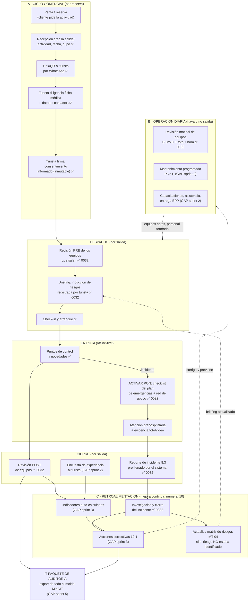

# Árbol documental NTC-ISO 21101 — del kit MinCIT a ColAdventure

> Fuente: kit oficial de plantillas del programa MinCIT/ACOTUR para PSTs
> (prestadores de servicios turísticos), carpeta Drive "Formularios" del
> 2026-07-12. Copia local en `knowledge-base/formatos/` (los PDFs guía no se
> versionan — regla de copyright del `.gitignore`).
>
> Este documento es la **espec maestra** que convierte ese kit en producto:
> qué documento genera el motor de IA, qué formato se vuelve un flujo vivo en
> la app (web/móvil), y qué material alimenta el RAG.

## 1. El principio del producto

El kit MinCIT confirma la tesis de ColAdventure: **las plantillas son
idénticas para todas las actividades de aventura** (rafting, torrentismo,
cabalgata, ATV…). Lo único que cambia es el contexto de cada actividad:
riesgos, equipos, competencias, lugar. Ese contexto ya vive en
`activity_profiles` (ficha técnica por actividad, migración 0031) y en el
onboarding. Por eso:

- **Un solo molde por tipo documental** (estructura, códigos, logo del PST,
  versión) — controlado por el sistema.
- **N contextos de actividad** — controlados por los datos del tenant.
- La IA solo extrae variables; el generador inyecta en el molde (regla de oro #1).

El kit además está escrito "para personas que apenas empiezan": cada formato
trae instrucciones de diligenciamiento. Esas instrucciones son oro para dos
cosas: los **microcopys de la app** (el guía ve en su teléfono lo mismo que
diría el consultor) y el **RAG** (chunks con `source='formatos_mincit'`).

## 2. Las tres clases de artefacto

| Clase | Qué es | Dónde vive en ColAdventure |
|---|---|---|
| **GEN** — documento generado | Procedimientos, políticas, planes: texto estable que se redacta una vez y se versiona | Motor de generación (`generation/generators/factory.py`), snapshot de reproducibilidad |
| **APP** — formato vivo | Registros que se diligencian a diario/por salida: la razón de ser de la app móvil. Cada registro guarda quién, cuándo (fecha+hora), evidencia foto/video y queda exportable al molde original para imprimir el día de la auditoría | Tablas Postgres con RLS + workflows por rol + builder de export (.xlsx/.docx) |
| **KB** — conocimiento | Talleres, guías, presentaciones, manual: explican el *cómo* | `knowledge_chunks` (pgvector) vía seed |

**La promesa central del producto:** el PST deja de diligenciar e imprimir
Excel. Cada empleado registra su trabajo diario desde su teléfono; la nube
arma el formato consolidado con fechas de qué se hizo y qué no; y el día de
la revisión (auditoría ONAC / RNT) se imprime el paquete completo tal cual
el molde MinCIT que el auditor espera ver.

## 3. Inventario completo del kit y su destino

### Numeral 4 — Comprensión de la organización y su contexto

| Archivo | Clase | Destino |
|---|---|---|
| 4.1 Taller contexto de la organización / Taller análisis contexto interno-externo | KB + onboarding | Las preguntas del taller (DOFA, PESTEL) alimentan `extraction_checklist` |
| 4.1 Plan estratégico NTC ISO 21101 (PDF) | KB | RAG |
| 4.2 Matriz de partes interesadas | GEN | Documento nuevo: matriz partes interesadas + necesidades/expectativas |
| 4.3 Alcance del SGSTA | GEN | Documento corto (1 pág): alcance del sistema; variable clave para TODOS los demás docs |
| 4.4 Caracterización del proceso + mapa de procesos (guía, taller, ejemplo) | GEN + KB | Caracterizaciones por proceso (entradas/salidas/PHVA); mapa de procesos como diagrama |

### Numeral 5 — Liderazgo y compromiso

| Archivo | Clase | Destino |
|---|---|---|
| 5.1 Acta de compromiso | GEN | Acta de compromiso de gerencia (firma digital del gerente al activar el tenant) |
| 5.2 Política de seguridad (+ taller) | GEN ✅ | Ya existe: **PO-01** |
| 5.3 Matriz de perfil de competencias | GEN ✅ | Ya existe: **MA-02** (manual perfiles de cargos) |
| 5.3 Procedimiento identificación y selección de personal | GEN | Procedimiento nuevo |
| 5.3 Programa de formación (xlsx) | APP | Cronograma vivo de capacitaciones: sesiones programadas vs ejecutadas |
| 5.3 Lista de asistencia | APP | Asistencia digital: el empleado firma en el teléfono del capacitador; si es virtual, foto de la reunión |
| 5.3 Formato evaluación de formación | APP | Quiz post-capacitación (califica eficacia de la formación) |
| 5.3 Formato entrega de dotación y EPP | APP | Acta digital de entrega: nombre, cédula, rol, nómina/contratista, elementos, cantidad, fecha, **firma en pantalla** + texto de compromiso legal (CST art. 56/58, Ley 9/79, Dec. 1295/94) |

### Numeral 6 — Planificación

| Archivo | Clase | Destino |
|---|---|---|
| 6.1.1 Procedimiento riesgos y oportunidades | GEN | Procedimiento nuevo |
| 6.1.1 Mapa de riesgos y oportunidades (xlsx, x2) | GEN ✅ | Ya existe: **MT-04** (matriz de riesgos) |
| 6.1.2 Contexto actividad turismo aventura (xlsx) | APP ✅ | Es exactamente `activity_profiles` — la ficha técnica por actividad ya modelada en 0031 |
| 6.1.2 Presentación riesgos en actividades (pptx) | KB | RAG |
| 6.1.3 Procedimiento requisitos legales | GEN | Procedimiento nuevo |
| 6.1.3 Matriz requisitos legales (xlsx) | GEN + APP | Se genera la matriz base por actividad (RNT, normas técnicas NTC 21102/21103, SNGRD…) y la app hace seguimiento de cumplimiento con fechas de verificación |
| 6.2 Matriz de objetivos de seguridad (xlsx, x2) | GEN + APP | Objetivos medibles (ya son variables de PO-01); la app calcula el avance real con los datos vivos |

### Numeral 7 — Apoyo

| Archivo | Clase | Destino |
|---|---|---|
| 7.1 Presupuesto del SGSTA | APP | Tabla simple de presupuesto anual con seguimiento |
| 7.4.1 Matriz de comunicación | GEN ✅ | Parte de **PR-07** (comunicación, participación y consulta) |
| 7.4.2 Procedimiento de comunicación y consulta | GEN ✅ | Ya existe: **PR-07** |
| 7.5.1 Procedimiento control de información documentada | GEN | Procedimiento nuevo |
| 7.5.1 Listado control de documentos (xlsx) | APP ✅ automático | **Ya lo tenemos gratis**: `document_status` + `documents` ES el listado maestro. Solo falta el export al molde MinCIT |

### Numeral 8 — Operación (el corazón de la app móvil)

| Archivo | Clase | Destino |
|---|---|---|
| 8.1 Planificación y control operacional (xlsx) | GEN | Por actividad: normas aplicables (nacional/internacional), aspectos a controlar, cómo se controlan |
| 8.1 Cronograma de mantenimiento (xlsx, 5 hojas) | APP | Sistema de ciclo de vida de equipos — ver §5.2 |
| 8.1 Revisión pre y post operacional de equipos (xlsx) | APP ⭐ | El flujo del mecánico — ver §5.1 |
| 8.1 Procedimiento selección/evaluación/control de proveedores + Lista + Formato selección-evaluación + Orden de compra | GEN + APP | Procedimiento generado; registro vivo de proveedores, evaluación anual y órdenes de compra |
| 8.1 Formato gestión de cambio | APP | Workflow de cambio: origen, análisis de impacto (13 aspectos), recursos, plan de acción, aprobación |
| 8.1/8.2 Anexo A Registro participantes | APP ✅ | Ya cubierto por `participantes` + `participante_salud` + `consentimientos` (0031). Gaps menores: ARL y campo "se le realizó inducción" — ver §5.4 |
| 8.2 Plan de emergencias turismo aventura | GEN ✅ + APP | El documento ya existe (**PL-01**). Lo nuevo: los **PONs** (antes/durante/después por escenario) se vuelven checklists accionables en el teléfono del guía — ver §5.3 |
| 8.3 Procedimiento gestión de incidentes | GEN ✅ | Ya existe: **PR-02** |
| 8.3 Formato registro e investigación de incidentes (xlsx) | APP ⭐ | El flujo post-incidente — ver §5.3 |

### Numeral 9 — Evaluación del desempeño

| Archivo | Clase | Destino |
|---|---|---|
| 9.1 Matriz de indicadores (xlsm) + Guía de elaboración | APP + KB | Dashboard de KPIs **auto-calculados** de los datos vivos (ver §6). La guía va al RAG |
| 9.1 Encuesta experiencia del participante | APP | Encuesta post-tour al turista por el mismo canal del registro (WhatsApp/link público): atención, seguridad percibida, NPS, PQRS |
| 9.2 Procedimiento auditoría interna | GEN | Procedimiento nuevo |
| 9.2 Programa + Plan + Lista de verificación + Informe de auditoría | APP | Módulo de auditoría interna (el módulo `quality` con `quality_reviews` es la semilla) |
| 9.3 Procedimiento revisión por la dirección | GEN | Procedimiento nuevo |
| 9.3 Formato revisión por la dirección | APP semi-generado | El sistema pre-llena las entradas (indicadores, incidentes, auditorías, acciones) y la gerencia registra decisiones |

### Numeral 10 — Mejora

| Archivo | Clase | Destino |
|---|---|---|
| 10.1 Procedimiento acciones correctivas y de mejora | GEN | Procedimiento nuevo |
| 10.1 Matriz de acciones CyM (xlsx) | APP | Acciones correctivas con seguimiento; se alimenta AUTOMÁTICO de incidentes (8.3), auditorías (9.2), encuestas (9.1) y revisión por la dirección (9.3) |
| 10.1 Guía análisis de causas | KB | RAG (5 porqués, espina de pescado — contexto para sugerir causas) |

### Raíz

| Archivo | Clase | Destino |
|---|---|---|
| MANUAL NTC ISO 21101 (docx, 6 MB) | KB | RAG — manual completo de implementación del programa |
| Guías de implementación / indicadores / integración (PDF) | KB | RAG (no versionadas en git) |

## 4. El flujo operativo (la historia end-to-end)

> Ajuste tras retroalimentación de Felipe (2026-07-12): el flujo NO inicia
> en la salida. Inicia en la **venta**, y hay operación diaria que existe
> **haya o no salidas** (revisión matinal de equipos, mantenimiento,
> capacitaciones). La salida es solo el punto donde el ciclo comercial y la
> operación diaria se encuentran. Y el ciclo no termina en el tour: la
> **retroalimentación** (incidentes, encuestas, indicadores) alimenta de
> vuelta la matriz de riesgos, el mantenimiento y la formación — eso ES la
> mejora continua del numeral 10.

El sistema opera en **tres planos** que se cruzan:

| Plano | Ritmo | Quién |
|---|---|---|
| **A. Ciclo comercial** | por reserva/venta | recepción → turista → guía |
| **B. Operación diaria** | todos los días, exista o no salida | logística/mecánico, coordinación |
| **C. Ciclo de mejora** | transversal y permanente | coordinación, gerencia |

Cada paso deja registro con **quién + fecha + hora + evidencia** — lo que el
auditor quiere ver meses después. Flujograma completo:

Lectura del flujograma:
- **La venta dispara el ciclo comercial**, no la salida: la salida es el
  contenedor operativo que recepción crea para esa reserva.
- **El plano B corre solo**: el mecánico revisa equipos cada mañana aunque
  no haya tours; el cronograma de mantenimiento y las capacitaciones son de
  calendario, no de salida. (Por eso `equipment_checks.salida_id` es
  opcional en la 0032.)
- **El plano C cierra el lazo**: un incidente cuyo riesgo no estaba en la
  matriz obliga a actualizar MT-04 y el próximo briefing; una encuesta mala
  o un indicador rojo generan acción correctiva que corrige la operación
  diaria. Nada muere en un archivo.

## 5. Formatos vivos: estructura de campos extraída del kit

### 5.1 Revisión pre y post operacional de equipos (8.1) ⭐ prioridad 1

Molde MinCIT: matriz semanal (lun–dom) × equipo (EPP clientes / EPP
instructores / equipos de operación) × momento (cantidad, antes, después),
con clasificación **B** (buen estado), **C** (cambio de equipo), **MC**
(mantenimiento correctivo), observaciones y nombre del responsable.
Los equipos se alimentan del formato "Identificación y descripción de equipos".

Digitalización (`equipment_checks`, **implementada en 0032**):
- `salida_id` opcional: la revisión matinal general no depende de una salida
- `item_id` → `operational_items` (categoría `equipo` ya existe)
- `phase`: `pre` | `post`
- `status`: `B` | `C` | `MC`
- `note`, `checked_by`, `checked_at` (hora real, no editable)
- evidencia foto/video → patrón `item_evidence` / bucket `evidence` ✅
- El export re-arma la matriz semanal del molde.

### 5.2 Ciclo de vida de equipos (8.1 — cronograma de mantenimiento, 5 hojas)

1. **BD grupos de equipos** (cascos, arneses, cuerdas, botes, chalecos…):
   especificaciones de inspección pre/post, especificaciones de
   mantenimiento, frecuencia, **criterios para dar de baja** (10 años, impacto
   forzoso, inspección desfavorable, obsolescencia normativa) → catálogo por
   tenant, se diligencia una vez.
2. **Identificación y descripción de equipos**: serial, fecha de fabricación,
   vida útil, usuario (cliente/instructor), tipo (EPP/operación/rescate),
   certificado (# y ubicación), manual del fabricante, dado de baja + fecha +
   justificación → extiende `operational_items.attributes`.
3. **Cronograma de mantenimiento**: programado (P) vs ejecutado (E) por semana
   /mes + índice de cumplimiento = E/P × 100 → `maintenance_plans`.
4. **Registro de mantenimiento**: equipo, tipo, proveedor externo,
   responsable, fecha, descripción → `maintenance_logs`.

### 5.3 Emergencias e incidentes (8.2 + 8.3) ⭐ prioridad 1

**PONs del plan de emergencias** (PL-01 ya los redacta): incidente/accidente,
incendio, fenómeno natural, inundación, evacuación, explosión/atentado,
accidente de tránsito — cada uno con "antes / durante / después".
En la app: el guía toca "ACTIVAR EMERGENCIA" → elige el escenario → ve el
checklist del PON + contactos de la red de apoyo (comité de búsqueda y
rescate, ambulancia, plan de ayuda mutua) con **botón de llamada directa**.
Cada paso marcado queda en `salida_eventos` con hora.

**Formato de registro e investigación de incidentes** (campos del molde):
- Tipo de actividad (15 opciones + otra)
- Fecha, hora, ubicación
- Guía líder + teléfono; demás trabajadores; participantes involucrados;
  testigos + su versión
- Descripciones: condiciones ambientales, estado de equipos y EPP usados,
  circunstancias del incidente, causas probables y factores contribuyentes,
  respuesta a la emergencia (incluido tratamiento médico), consecuencias,
  planes de acción / medidas correctivas
- Fuente de la información; **¿el riesgo ya estaba identificado en la matriz?**
  (sí/no — conecta con MT-04); investigadores (nombres y cargos); observaciones

Digitalización (`incident_reports`, **implementada en 0032**): la mitad se
**pre-llena sola** (salida, actividad, autoría, hora); el guía narra y sube
evidencia (su reporte nace en `borrador` y solo él lo edita en ese estado);
el coordinador completa la investigación y lo cierra (`en_investigacion` →
`cerrado`, sin reapertura). Si "riesgo no identificado" → dispara
actualización de la matriz de riesgos y una acción correctiva (10.1). Los
PONs también quedaron en 0032 como eventos (`emergencia_activada`,
`pon_paso`, `emergencia_cerrada`).

### 5.4 Registro de participantes — Anexo A (8.1/8.2)

Ya cubierto en 0031, gaps cerrados en 0032:
- campo **ARL** (además de EPS) en `participante_salud` ✅ 0032
- la **inducción de riesgos** del Anexo A se deriva del evento `induccion`
  en `salida_eventos` ligado al participante ✅ 0032
- el texto de tratamiento de datos del molde sirve de base para el
  `consent_template` (pendiente el texto definitivo de Felipe — PO-02)

### 5.5 Entrega de dotación y EPP (5.3)

Nombre, cédula, cargo/rol, vinculación (nómina/contratista), elemento,
cantidad, fecha, **firma de recibido** + compromiso legal. Digital: firma en
pantalla (mismo patrón de `consentimientos`), inmutable.

### 5.6 Capacitaciones (5.3)

- **Lista de asistencia**: dirigido a, temas, conferencista, horas, lugar,
  fecha, modalidad (virtual → foto de la reunión en vez de firmas);
  asistentes: nombre, celular, cargo/rol, firma.
- **Evaluación de formación**: quiz de eficacia.
- **Programa de formación**: cronograma anual programado vs ejecutado.

### 5.7 Encuesta de experiencia (9.1)

Autorización de datos, escala 1–5 (atención, conocimiento del personal,
estado de los elementos), preguntas de seguridad (¿actividades seguras?,
¿le informaron normatividad?, ¿le informaron riesgos? — sí/no), canal de
adquisición, satisfacción general, ¿recomendaría? (NPS), ítems por mejorar,
sección accesibilidad (discapacidad), PQRS. Bilingüe ES/EN en el molde.

### 5.8 Gestión de cambio (8.1)

Tipo (planificado/no planificado), origen (11 opciones), análisis de impacto
sobre 13 aspectos del SGSTA, recursos + costo, plan de acción con
seguimiento, aprobación (responsable, fecha, cargo).

## 6. Indicadores (9.1) — el dashboard se calcula solo

La ventaja competitiva: en papel el PST calcula indicadores a mano; en
ColAdventure salen gratis de los datos vivos:

| Indicador (kit MinCIT) | Fuente automática |
|---|---|
| Cumplimiento cronograma mantenimiento (E/P × 100) | `maintenance_plans` vs `maintenance_logs` |
| % inspecciones pre/post realizadas | `equipment_checks` vs salidas |
| Incidentes por actividad / por N salidas | `incident_reports` + `salidas` |
| % participantes con inducción registrada | eventos `induccion` / `participantes` |
| Satisfacción y NPS | `survey_responses` |
| % personal con formación vigente | `training_attendance` + `training_sessions` |
| Cumplimiento de objetivos de seguridad (6.2) | metas vs indicadores anteriores |
| Cierre de acciones correctivas | `corrective_actions` |

## 7. Roadmap propuesto (después de validar el MVP con Felipe)

**Regla intacta:** no construir el árbol completo hasta validar el núcleo
(PO-01, MT-04, PL-01, PR-02) — CLAUDE.md. Este roadmap ordena lo que sigue.

1. **Sprint terreno 1 (la demo que vende)** ✅ HECHO (migración 0032 +
   endpoints, 2026-07-12): `equipment_checks` + `incident_reports` +
   inducción del participante + eventos PON. Falta del sprint: subida de
   evidencia (signed URLs), pantallas móviles y aplicar 0032 al remoto.
2. **Sprint terreno 2:** ciclo de vida de equipos (mantenimiento §5.2) +
   entrega EPP + encuesta post-tour (reutiliza el patrón token público).
3. **Sprint gestión:** capacitaciones, proveedores, gestión de cambio,
   acciones correctivas, requisitos legales con seguimiento.
4. **Sprint cierre del árbol GEN:** los ~10 procedimientos nuevos entran a
   `_REGISTRY` uno a uno (alcance 4.3 primero: es variable de los demás).
5. **Sprint auditoría:** módulo 9.2 (programa/plan/informe), revisión por la
   dirección 9.3 semi-generada, botón "paquete de auditoría" (export de todos
   los formatos vivos al molde MinCIT).

**Seed pendiente de conocimiento:** `knowledge-base/formatos/` → chunks con
`source='formatos_mincit'` (manual, guías, talleres, instrucciones de
diligenciamiento de cada formato).

## 8. Reglas que este corpus confirma

- Códigos de documento (`CÓDIGO:` / `VERSIÓN:` en todos los moldes) — ya son
  dato por tenant (fix del piloto). El export debe rellenarlos.
- "LOGO DEL PST / NOMBRE DEL PST" en cada encabezado → branding por tenant en
  todos los exports.
- El formato de listado maestro (7.5.1) lo generamos automático desde
  `documents`/`document_status` — ningún competidor de papel puede hacerlo.
- Los datos de salud del Anexo A confirman la separación
- La firma de recibido/asistencia/consentimiento aparece en 5 formatos →
  patrón único de firma digital (trazo + hash + timestamp, Ley 527/1999),
  ya modelado en `consentimientos`.
